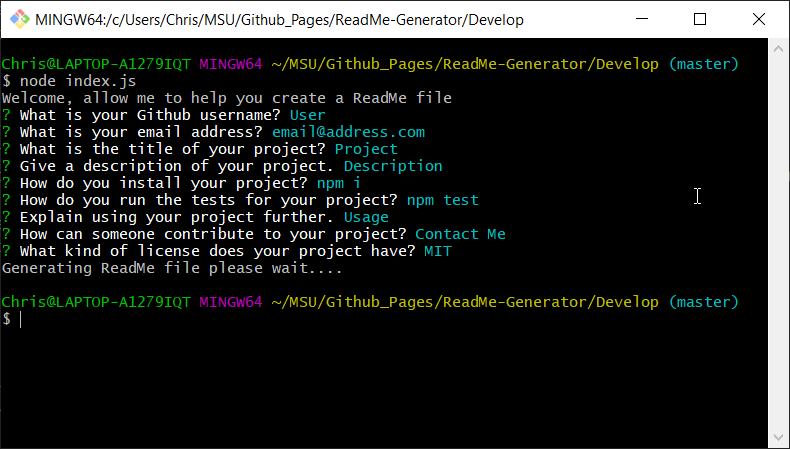
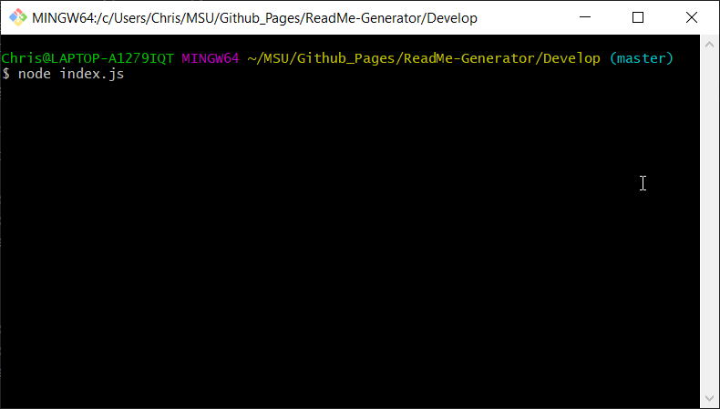

# ReadMe Generator

This project was designed as a homework assignment for MSU's coding bootcamp. 

This application was created with the use of Javascript, Node.JS. This was created to help developers spend less time creating a readme md file for their github and more time on their projects.

This projects' code can be found on my github (Link can be found below).

# Table of Contents
1. [Links](#Links)
2. [Project Overview](#projectoverview)
3. [Execution](#Execution)
4. [Contains](#Contains)

## Links

* [GitHub Repository](https://github.com/CMarcano7/ReadMe-Generator)

## Project Overview 

* This project prompts the users with a list of questions generated by the javascript file index.js and with their answers a md readme file is created. This readme created is named after the user's project title as well as all of the users input placed within the file.
* Javascript, node.js and inquirer.js

## Execution
### To Execute File:
> Open within your terminal and execute the following code node index.js 

## Contains: 
* Javascript Files
    * index.js
    * generateMarkdown.js 

* Inquirer.js
    * [Inquirer](https://www.npmjs.com/package/inquirer)

* Find node.js docs [Here](https://nodejs.org/dist/latest-v14.x/docs/api/)

* MSU BootCamp